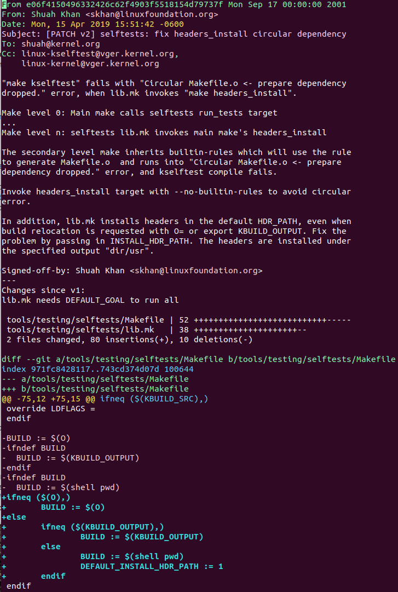

# Code Review and Submit Changes

## git email configurations

we need one server/host and one email client for successful email configuration. I am using gmail as server/host and MUTT as email client. You are free to choose anything. Refer [https://useplaintext.email/](https://useplaintext.email/), [https://www.kernel.org/doc/html/latest/process/email-clients.html](https://www.kernel.org/doc/html/latest/process/email-clients.html). \
git email is also email client but we will use it only for sending patch email and mutt to be able send responses, to review comments, and other communication with the community.

### **Gmail account setup(Server)**

1. create new google account for linux kernel developement. This is optional but I recommend.
2. Configure your Google Account to have&#x20;
   1. **2-factor authentication** (to enable app-specific passwords)
   2. an **app-specific password** for gmail to be used by `git send-email`:
3.  **Configure 2-factor authentication:** \
    go to [https://myaccount.google.com/security](https://myaccount.google.com/security) --> scroll down to "2-Step Verification" and follow the process to turn it on.

    <figure><figcaption><p><strong>Configure 2-factor authentication for gmail</strong></p></figcaption></figure>
4.  **Generate an app-specific password of Gmail for git to use:** \
    go to the link just above, scroll down to "App passwords" and click on it. Select "Mail" as the app and Select "Other _(Custom name)_" as the device. Name device as _git send-email_ or similar. Click the "GENERATE" button. It will pop up with a 16-digit full-access password. Write it down, without the spaces in it. It is just the 16 chars.

    <figure><figcaption><p>select "MAIL" as app</p></figcaption></figure>

    <figure><figcaption><p>select "other" as device</p></figcaption></figure>


5. Similarly generate password for mutt.
6. In **Gmail,**
   1. click on gear icon and go to settings
   2. &#x20;go to tab _**Forwarding POP/IMAP**_ and click the _**Configuration instructions**_ link in IMAP Access row.
   3. click "I want to enable IMAP"
   4. At the bottom of the page, under the paragraph about configuring your mail client, select _**Other**_.&#x20;
   5. Note the mail server information and use that information for further settings as shown in the next section.

### **git send-email/gitconfig setup(client)**

* we need to do git-email configuration to send patches using send-email command.
* Once you place the configuration in your **.gitconfig** file, running **git send-email mypatch.patch** is all you have to do to send patches; **mypatch.patch** is generated by the **git format-patch** command.


1.  update \~/.gitconfig as follows:

    _Note: change your name, email id and SMTP server details setting if not using Gmail._\
    __read for more at [https://git-send-email.io/](https://git-send-email.io/), [https://useplaintext.email/](https://useplaintext.email/), [https://www.kernel.org/doc/html/latest/process/email-clients.html](https://www.kernel.org/doc/html/latest/process/email-clients.html)

    
    ```
    [user]
    	name = Prasad Sunil Udawant
    	email = prasad.udawant.linux@gmail.com
    	
    [sendemail]
    	from = Prasad Sunil Udawant <prasad.udawant.linux@gmail.com>
    	smtpuser = prasad.udawant.linux@gmail.com
    	smtpencryption = tls
    	smtpserver = smtp.gmail.com
    	smtpserverPort = 587
    	chainreplyto = false
    	smtpPass = <get this password from google app password we configured in above steps for git-send email app>
    	confirm = always
    	annotate = true

    [format]
        	signoff=true
    [core]
    	editor = vi
    ```
    
2. set following configuration for safety&#x20;
   1.  to open email in git editor for review.

       _`git config --global sendemail.annotate true`_
   2.  to always confirm before sending email

       _`git config --global sendemail.confirm always`_
   3.  After setting this perform dry-run by executing following to confirm setup is ready. it will not send email.

       _git send-email --to="\<yout email id >" --dry-run \<patch path>_
   4. &#x20;Make sure that the email you specify here is the same email you used to set up sending mail. The Linux kernel developers will not accept a patch where the "From" email differs from the "Signed-off-by" line, which is what will happen if these two emails do not match. Make sure you store your full, legal name in the 'name' line

### **Setting up mutt with Gmail on Ubuntu (email client)**


\


\
